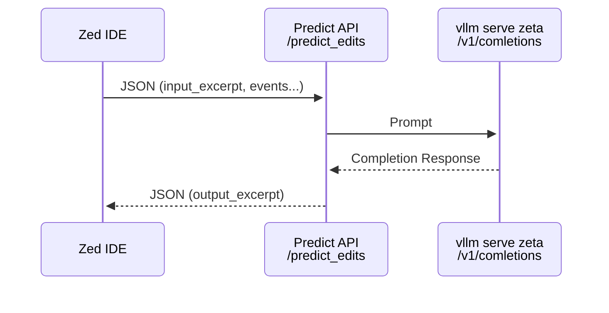

## Running server

FYI this is just for fun, it is not a production-ready server. Great for learning!

```bash
# create venv (pick one):
python -m venv venv
uv venv

# activate venv
source venv/bin/activate

# install deps (pick one):
pip install -r requirements.txt
uv pip install -r requirements.txt

# run server
./run.sh

# point zed at the server:
export ZED_PREDICT_EDITS_URL=http://localhost:1234/predict_edits
zed

```

## Parts

- [setup-uv-venv.sh](setup-uv-venv.sh) - run this to setup with `uv` command
   - does same things as above with `pip install`
- [sync/server.py](sync/server.py) - new, sync FastAPI server w/ disconnect support (client disconnect propagates instantly to vllm (or other completions backend))
- [notes/sleeper](notes/sleeper)
  - demo of client disconnect through a proxy back to an upstream using FastAPI
- [sync/test-predict_edits.sh](sync/test-predict_edits.sh) - test a request thru this FastAPI server back to vllm

## zeta.nvim experimental plugin

I'm working on a POC for using zeta model predictions in neovim.
Here is the repo: https://github.com/g0t4/zeta.nvim

## Predictions Backend Architecture


