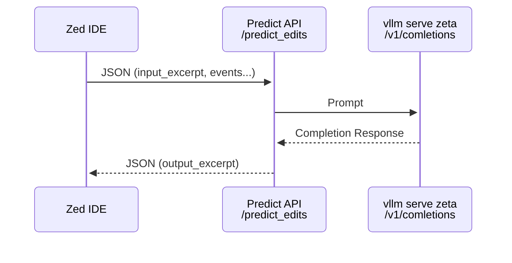

## Running server

FYI this is just for fun, it is not a production-ready server. Great for learning!

```bash
# create venv
python -m venv venv
uv venv

# activate venv
source venv/bin/activate

# install deps
pip install -r requirements.txt
uv pip install -r requirements.txt

# run server (now uses fastapi)
./run.sh

```

## Parts

- `setup-uv-venv.sh` - run this to setup with `uv` command
   - does same things as above with `pip install`
- `server/new.py` - new FastAPI server w/ disconnect support (client disconnect propagates instantly to vllm (or other completions backend))
- `server/test-server.sh` - test a request thru this FastAPI server back to vllm
  - ctrl-c to test client disconnect, shows abort in vllm (and other backends if they suppport it)
  - wait for it to complete and you'll see output_excerpt!
- `server/new.py` - has a few test endpoints for learning/testing client disconnect and propagating the disconnect
  - `server/cancel-httpx.py` - shows how a standalone client can disconnect when using httpx client 
    - this is not propagating to an upstream
    - this is just client to server and what disconnect looks like on both sides

## Running zed w/ server

```bash
export ZED_PREDICT_EDITS_URL=http://localhost:1234/predict_edits
zed
```

## zeta.nvim experimental plugin

I'm working on a POC for using zeta model predictions in neovim.
Here is the repo: https://github.com/g0t4/zeta.nvim

## Predictions Backend Architecture



