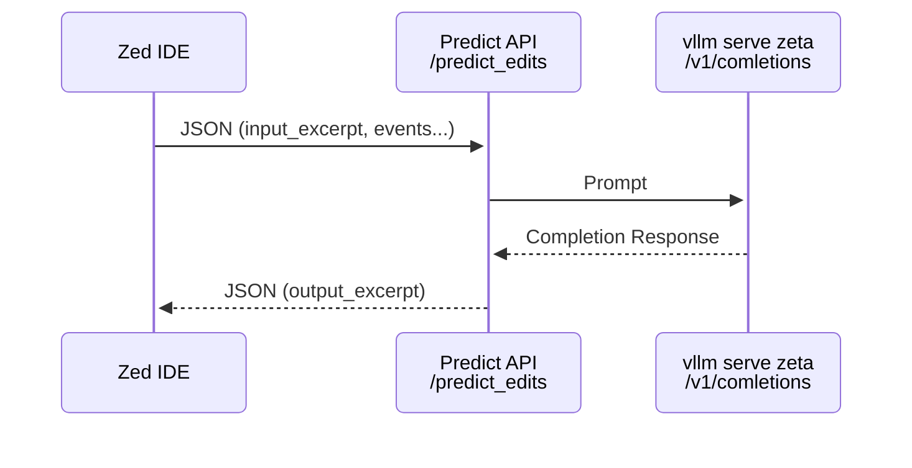

## Predictions Backend Architecture

```mermaid
---
config:
  theme: mc
  look: neo
---
sequenceDiagram
    participant ZedIDE as Zed IDE
    participant API as Predict API<br> /predict_edits
    participant Zeta as vllm serve zeta<br> /v1/comletions
    ZedIDE->>API: JSON (input_excerpt, events...)
    API->>Zeta: Prompt 
    Zeta-->>API: Completion Response
    API-->>ZedIDE: JSON (output_excerpt)
```
