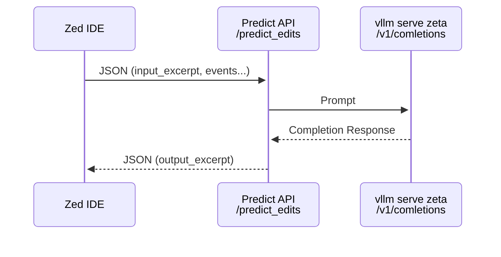

## Running server

FYI this is just for fun, it is not a production-ready server. Great for learning!

```bash
# create venv
python -m venv venv
uv venv

# activate venv
source venv/bin/activate

# install deps
pip install -r requirements.txt
uv pip install -r requirements.txt

# run server
ipython3 server/server.py

```

## Running zed w/ server

```bash
export ZED_PREDICT_EDITS_URL=http://localhost:1234/predict_edits
zed
```

## zeta.nvim experimental plugin

I'm working on a POC for using zeta model predictions in neovim.
Here is the repo: https://github.com/g0t4/zeta.nvim

## Predictions Backend Architecture



