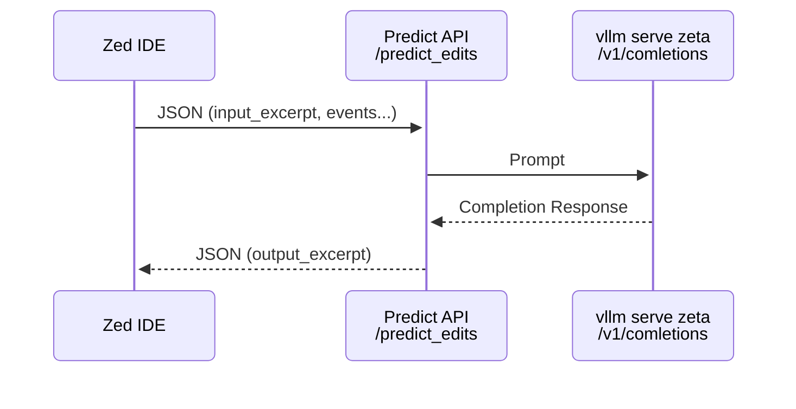

## Running server

```bash
# create venv
python -m venv venv
uv venv

# activate venv
source venv/bin/activate

# install deps
pip install -r requirements.txt
uv pip install -r requirements.txt

# run server
ipython3 server/server.py

```


## Predictions Backend Architecture



