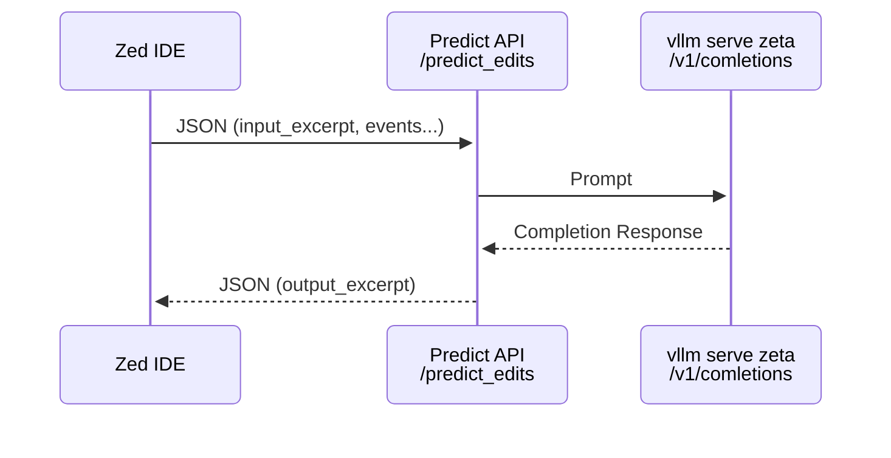

## Running server

FYI this is just for fun, it is not a production-ready server. Great for learning!

```bash
# create venv (pick one):
python -m venv venv
uv venv

# activate venv
source venv/bin/activate

# install deps (pick one):
pip install -r requirements.txt
uv pip install -r requirements.txt

# modify OPENAI_COMPAT_V1_COMPLETIONS_URL (see sync/server.py)

# run server
./run.sh
```

## Serving the model

Note: use ollama first if you aren't versed in `vllm`! Only need `vllm` if you want to run the original model with full precision.

```sh
# original, finetuned model (full precision):
vllm serve zed-industries/zeta
# speculative decoding, recommended: https://huggingface.co/zed-industries/zeta
vllm serve zed-industries/zeta --served-model-name zeta --enable-prefix-caching --enable-chunked-prefill --quantization="fp8" --speculative-model [ngram] --ngram-prompt-lookup-max 4 --ngram-prompt-lookup-min 2 --num-speculative-tokens 8
# TODO wes run some tests of spec dec again and see if I want to tweak this recommendation

# ollama compat, quantized model (not same as full precision):
# Q4_K_M is best just to test things work
# Q8_0 if you want higher precision (closer to full precision)
ollama serve
ollama pull huggingface.co/lmstudio-community/zeta-GGUF:zeta-Q4_K_M.gguf
ollama pull huggingface.co/lmstudio-community/zeta-GGUF:zeta-Q8_0.gguf
# pulls zeta-Q4_K_M.gguf
# there's also Q8_0 (higher precision)
#
# * make sure to modify sync/server.py to provide the model name in the request parameters (uncomment the example code)
# *** FYI client disconnects are not propagated to ollama right now, I need to check what's going on and fix before this will work well
#   so if you start typing, that's going to fire a series of requests and then you'll have to wait for all of them to finish before the last one will complete
#   vLLM doesn't have this issue currently
#   you can still test that predictions work, just type one char in zed, or go into inser mode and then you'll get a prediction!
#
# alternatives (look for GGUF in name or description):
#   https://huggingface.co/models?other=base_model:quantized:zed-industries/zeta

```

## Testing Predictions

```sh
# (optional) test predictions without zed:
sync/test-predict_edits.sh
# use this to test if model/server are working before using zed

# test zed w/ mitmproxy
#  inspect requests/responses from/to zed
#  you can proxy localhost too, just a smidge more work
# bind to public IP to use mimtmproxy
export ZED_PREDICT_EDITS_URL=http://0.0.0.0:9000/predict_edits
mitmproxy --mode=local:zed

```

## Using Zed

```sh
export ZED_PREDICT_EDITS_URL=http://localhost:9000/predict_edits
zed
```

## Parts

- [setup-uv-venv.sh](setup-uv-venv.sh) - run this to setup with `uv` command
    - does same things as above with `pip install`
- [sync/server.py](sync/server.py) - new, sync FastAPI server w/ disconnect support (client disconnect propagates instantly to vllm (or other completions backend))
- [notes/sleeper](notes/sleeper)
    - demo of client disconnect through a proxy back to an upstream using FastAPI

## zeta.nvim experimental plugin

I'm working on a POC for using zeta model predictions in neovim.
Here is the repo: https://github.com/g0t4/zeta.nvim

## Predictions Backend Architecture


